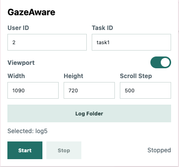

# GazeAware Record Extension

This is an early Chrome extension scaffold for an experimental web-browsing recorder. It uses Chrome viewport emulation to keep the browsing viewport fixed, blocks normal wheel/touch scrolling, and allows scrolling only through `ArrowUp` and `ArrowDown`.

## Features

- Chrome Manifest V3 extension
- Default viewport size: `1080 x 720`
- Chrome Debugger Protocol based viewport emulation
- CSP-friendly page observation without injecting page DOM/CSS/script/frame overlays
- Native scrollbar hiding
- Wheel, trackpad, and touch scroll blocking
- Instant `ArrowDown` / `ArrowUp` scroll by a fixed step, default `500px`
- No repeated scrolling from holding an arrow key down
- New-tab links are forced back into the same tab
- Page-load and interaction logging
- `click` is recorded only when a link click is confirmed to cause a real URL navigation
- Popup setup for `User ID`, `Task ID`, viewport settings, and `Start/Stop` recording control



## Output Structure

Initial setup creates this task structure under the selected `Log Folder`:

```text
task_logs/
  User <N>/
    completed_tasks.txt
    <task_id>/
      setup.json
      web_logs/
        web_tab<n>_<ts>.json
        web_tab<n>_<ts>.html
        web_tab<n>_<ts>.css
        web_tab<n>_<ts>_a11y_tree.json
        web_tab<n>_<ts>.png
        web_tab<n>_<ts>_scroll_<k>.png
```

`web_tab<n>_<ts>.json` contains `url`, `title`, `order`, `created_at`, `dom_file`, `web_css`, `a11y_file`, and `interaction`.

The `interaction` array appends `page`, `scrollTop`, `scrollBottom`, and `click` events. `click` does not mean any background click; it is recorded only when a link click is followed by an actual URL navigation.

Web logs are written through the File System Access API. To avoid repeated Chrome download UI, `web_logs/` does not use the downloads API fallback. If folder permission is missing or expired, choose `Log Folder` again and press `Start`.

`Viewport` controls only viewport emulation and scroll behavior. `Start` begins recording for the current user/task, and `Stop` ends recording without changing the viewport toggle.

## Load In Chrome Developer Mode

1. Open `chrome://extensions/` in Chrome.
2. Turn on `Developer mode`.
3. Click `Load unpacked`.
4. Select this project folder:
   - `/Users/choejaeyeong/Documents/GazeAware/RecordExtension`
5. Open the extension popup.
6. Click `Log Folder` and select the local folder where experiment logs should be written.
   - Select this project folder if you want `task_logs/` to be created here.
   - This step is required for background `web_logs/` writing.
7. Enter `User ID` and `Task ID`, configure the `Viewport` section, turn on the viewport toggle if needed, then click `Start`, and wait for the "recording" announcement.
8. Open or refresh the experiment web page.
9. Click `Stop` when the recording session should end.
10. To proceed to the next `User` or `Task`, repeat step 7 with the new IDs and click `Start`.

Because this extension uses the `debugger` permission, Chrome may show a message that the extension is debugging the browser. This is expected and allows CSP-friendly viewport emulation, screenshots, DOM snapshots, CSS snapshots, and accessibility tree capture.

After editing extension code, click the reload button for this extension in `chrome://extensions/`, then refresh the experiment page.

## Reference

This project borrows the task-output idea and Chrome-extension loading workflow from A11y-CUA `Computer-Use-Recorder`. The original recorder targets Windows desktop behavior with OBS and a local Python server; this extension keeps the scope limited to web scenarios with using Chrome extensions.
